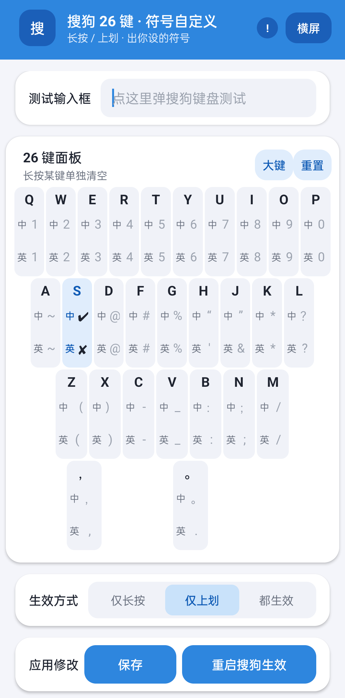

# 搜狗符号

为搜狗输入法 26 键键盘自定义符号的 LSPosed 模块。中文、英文分别设置，支持字母键长按和上划，也支持独立逗号、句号键的点击替换。

[下载最新 APK](https://github.com/ssuper1/sougou/releases/latest) · [版本记录](docs/releases/v0.86.md) · [反馈问题](https://github.com/ssuper1/sougou/issues)

<p>
  
  
</p>

## 功能

- 26 个字母键及逗号、句号均可分别配置中文和英文符号。
- 字母键角标显示自定义符号与原符号，生效方式可选仅长按、仅上划或都生效。
- 独立逗号、句号键在所有模式下点击都输出自定义符号；搜狗 v20 的键面也显示自定义符号。
- 符号面板中的点选保留原符号。
- 支持横屏、深色模式、大键设置、单键清空和全部重置。
- 内置测试输入框，可保存配置并通过 Root 重启搜狗。

## 环境与兼容范围

- Android 7.0 及以上，已 Root，并安装可用的 LSPosed/Xposed 环境。
- 作用域：搜狗输入法 `com.sohu.inputmethod.sogou`。
- 模块包名：`com.qoder.sogousym`。

| 搜狗版本 | 适配情况 |
| --- | --- |
| 12.0（versionCode 2180） | 适配字母键、长按气泡及热补丁加载；独立标点点击可替换，键面仍显示原标点 |
| 20.17.0（versionCode 2620） | 适配字母键、长按气泡、独立标点键面及点击替换 |

适配依赖搜狗内部类及键盘布局，其他版本、第三方皮肤和非 26 键布局不保证兼容。v12 的最新热补丁监听调整通过单元测试，尚未重新进行 v12 实机回归；详细验证范围见[版本记录](docs/releases/v0.86.md)。

## 安装与使用

免 Root 双包方案已完成短时实机验证；内置配置页的单包方案仍处于开发验证阶段。构建及使用说明见[免 Root 构建](docs/nonroot.md)。下列步骤适用于原有 Root / LSPosed 版本。

1. 从 [Releases](https://github.com/ssuper1/sougou/releases) 下载并安装 APK。
2. 在 LSPosed 中启用「搜狗符号」，作用域仅勾选搜狗输入法。
3. 打开模块，在键位的「中」「英」输入框填写符号，并选择生效方式。
4. 点击「重启搜狗生效」，授予模块 Root 权限。此操作先保存，再强停搜狗。
5. 在测试输入框或其他应用中验证显示和输出。

不向模块授予 Root 时，可先「保存」，再通过「搜狗·强行停止」打开应用信息页，手动强行停止搜狗，然后重新唤起键盘。Magisk 使用 SuList/白名单时，需将模块加入白名单才能使用内置重启功能。

仅点击「保存」不会保证正在运行的搜狗立即重载配置。升级模块 APK 后，也需真正重启搜狗进程才能加载新代码。

### 生效方式

| 模式 | 字母键长按 | 字母键上划 | 独立逗号、句号点击 |
| --- | --- | --- | --- |
| 仅长按 | 自定义符号 | 原符号 | 自定义符号 |
| 仅上划 | 原符号 | 自定义符号 | 自定义符号 |
| 都生效 | 自定义符号 | 自定义符号 | 自定义符号 |

上划指搜狗识别的快速上划手势；按住后再滑可能被识别为长按。

### 配置说明

- 留空使用原符号；长按设置面板上的某个键可清空该键，点击「重置」可清空全部配置。
- 保存时去除首尾空白，例如 `✘ ` 会保存为 `✘`。
- 建议填写单个符号。字母长按路径只保留首字符，不保证多字符文本、组合 emoji 等内容可用；复杂字形的显示还取决于搜狗字体与布局。

## 常见问题

**配置没有生效，或升级后仍是旧行为？**

检查 LSPosed 的模块开关和搜狗作用域，确认正在使用 26 键布局，然后保存并强行停止搜狗再打开。遇到签名不一致而无法覆盖安装时，需要使用相同签名的 APK，或记录配置后卸载旧模块再安装。

**逗号、句号为什么不受「仅上划」模式控制？**

它们是独立点击键，没有上划和长按功能，始终按点击配置处理。v12 当前只替换点击输出，不修改这两个键的键面。

**ColorOS 上输入一会儿后卡死，尤其是卸载重装搜狗之后？**

本项目实机排查遇到过 ColorOS HANS 保留旧输入法 UID、冻结当前搜狗进程的情况。可先切换到另一款已安装的输入法，再切回搜狗，让系统刷新输入法记录；若只有一款输入法，可尝试重启手机，但本次未验证重启方案。这个问题由系统缓存引起，模块 APK 不包含修改系统冻结策略或后台保活的功能。

并非所有卡顿都由这一原因造成。反馈时请提供 Android/ROM、搜狗版本、模块版本、键盘皮肤、生效模式及复现步骤，并说明关闭模块后是否仍出现。

**是否测试过耗电与长时间稳定性？**

模块没有后台保活服务、唤醒锁、定时报警或网络请求，输入与绘制路径已减少重复反射、日志和调用栈采集。已进行单元测试及短时实机回归，尚未进行长期电量对照，不能据此承诺耗电降幅或所有系统上的长期稳定性。

## 源码构建

工具链：Gradle 9.4.1、AGP 9.2.1、Gradle Daemon JDK 21、Android SDK 37.1；`minSdk 24`、`targetSdk 36`。安装所需 SDK 并设置本地 `local.properties` 或 `ANDROID_HOME`。

Windows：

```powershell
.\gradlew.bat :app:assembleRelease :app:testDebugUnitTest :app:lintRelease
```

Linux/macOS：

```sh
./gradlew :app:assembleRelease :app:testDebugUnitTest :app:lintRelease
```

APK 输出：`app/build/outputs/apk/release/app-release.apk`。

直接运行上述 Gradle 命令生成的是 Root / LSPosed 版单个插件 APK。安装后需要 Root、LSPosed/Xposed，并在 LSPosed 中启用「搜狗符号」且勾选搜狗输入法作用域。

免 Root 方案通过 `tools/nonroot/build.ps1` 构建：`-Mode companion` 生成修改版搜狗输入法和独立配置 App 两个 APK，产物位于 `build/nonroot/companion/`；`-Mode embedded` 生成将配置页打入搜狗的单 APK 原型，当前仍需实机验证。完整命令和使用步骤见[免 Root 构建](docs/nonroot.md)。

当前 Release 构建启用代码优化，使用开发签名配置。不同机器的开发密钥通常不同，自行构建的 APK 不保证能覆盖 Releases 安装包；请保管好自己的签名密钥。

单元测试位于 `app/src/test`；设备诊断测试位于 `app/src/androidTest`，其临时测试输入法不包含在生产 APK 中。
